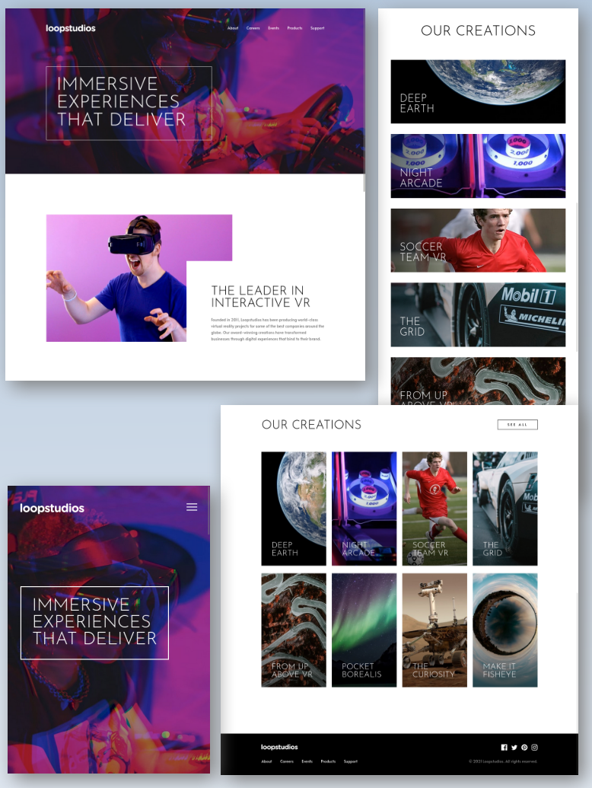

# Frontend Mentor - Loopstudios landing page solution

This is a solution to the [Loopstudios landing page challenge on Frontend Mentor](https://www.frontendmentor.io/challenges/loopstudios-landing-page-N88J5Onjw). Frontend Mentor challenges help you improve your coding skills by building realistic projects.

## Table of contents

- [Overview](#overview)
  - [The challenge](#the-challenge)
  - [Screenshot](#screenshot)
  - [Links](#links)
- [My process](#my-process)
  - [Built with](#built-with)
- [Author](#author)

## Overview

### The challenge

Users should be able to:

- View the optimal layout for the site depending on their device's screen size
- See hover states for all interactive elements on the page

The designs were created to the following widths:

- Mobile: 375px
- Desktop: 1440px

### Screenshot

### Links

- Live Site URL: [frontend-mentor-landing-page-nine.vercel.app](https://frontend-mentor-landing-page-nine.vercel.app/)

## My process

### Built with

- Astro, with HTML, CSS, and basic JS
- Mobile-first workflow

## Author

- Website - [linkedin](https://www.linkedin.com/in/artur-jedrzejczak/)
